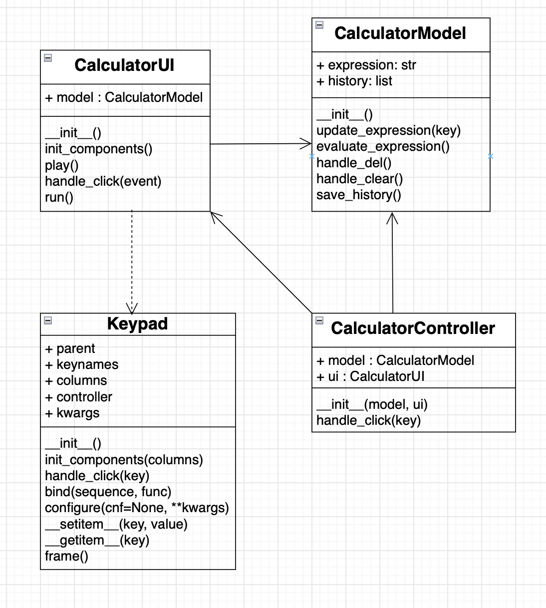

## calculator

A Calculator using Python Tkinter graphics.

| file                     | Description                                |
|--------------------------|--------------------------------------------|
| calculator_model.py      | Model for a calculator                     |
| calculator_controller.py | The controller of a calculator.            |
| calculator_ui.py         | The CalculatorUI class for user interface. |
| calculator_app.py        | main block to run the program.             |
| keypad.py                | keypad for a calculator                    |
| error-126627.mp3         | error sound                                |


### How to Run

```
python calculator_app.py
```

### UML class diagram
